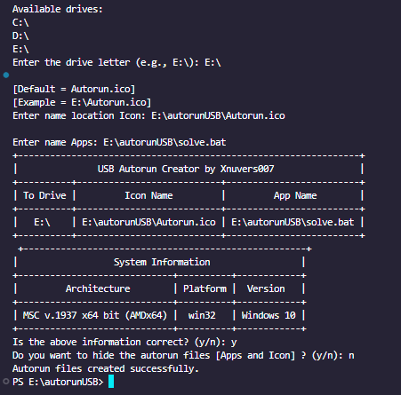
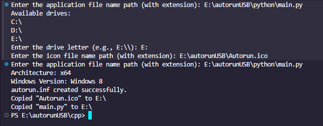
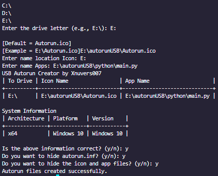

#    AutorunUSB

Welcome to **AutorunUSB**, a powerful tool designed to provide an autorun feature for USB drives. It allows you to automatically execute a script or application when the USB drive is connected to a computer.

## Table of Contents 🔥

- [Features](#Features)
- [How To Remove](#how-to-remove)
- [Installation](#installation)
- [Usage](#usage)
  - [Windows](#windows)
  - [Python](#python)
  - [CPP](#cpp)
  - [Java](#java)
  - [Batch/CMD/Powershell](#Batch/CMD/Powershell)
- [Contributing](#contributing)
- [License](#license)
- [Contact](#contact)
- [Beware](#beware)
- [Issues](#issues)
- [Pull Requests](#pull-requests)


## Features

- **Automatic Execution**: Seamlessly run scripts or applications upon USB connection.
- **Customizable**: Easily configure and customize to fit your needs.
- **Lightweight**: Minimal resource usage ensures efficiency.
- **Compatibility**: Fully compatible with Windows operating systems.
- **Open Source**: Free to use and modify under the MIT License.

## How To Remove ?

1. Open the Powershell or Command Prompt as an administrator.
2. go to the USB drive directory.
3. Run the following command to remove the autorun.inf file.
    ```sh
    cd /d <USB Drive Letter>:
    attrib -h -r -s autorun.inf
    del autorun.inf
    attrib -h -r -s *.ico
    del <delete Your icon in autorun.inf>.ico
    attrib -h -r -s <Your Script/App>.<the extension>
    del <Your Script/App>.<the extension>
    ```

or **You can double click solve.bat**

## Installation

1. Clone the repository to your local machine:
    ```sh
    git clone https://github.com/Xnuvers007/AutorunUSB.git
    ```
2. Navigate to the project directory:
    ```sh
    cd AutorunUSB
    ```
3. Follow the configuration instructions below to set up your autorun script.

## Usage

Simply connect the USB drive to a computer, and the specified script or application will run automatically.

### Windows

You can use it easily on Windows. Just follow the steps below:

1. go to [Apps](Apps) folder.
2. Run [USB Autorun By Xnuvers007.exe](Apps/USB%20Autorun%20By%20Xnuvers007.exe).
3. Don't move the Files USB Autorun By Xnuvers007.exe
4. Follow the instructions on the screen.

### Python



You can also use it on Python. Just follow the steps below:
1. Navigate to the `python` directory:
    ```sh
    cd python
    ```
2. Install the required packages:
    ```sh
    pip install -r python/requirements.txt
    ```
3. Run the script:
    ```sh
    python main.py
    ```
4. Follow the instructions on the screen.

**NOTE : Python Version 3.8 or higher is required.**

### CPP



You can also use it on C++. Just follow the steps below:
1. Navigate to the `cpp` directory:
    ```sh
    cd cpp
    ```
2. Compile the source code:
    ```sh
    g++ main.cpp -o autorun
    ```
3. Run the executable:
    ```sh
    ./autorun
    ```
4. Follow the instructions on the screen.

**NOTE : GCC Compiler is required.**

Download GCC Compiler from [Server 1](https://sourceforge.net/projects/mingw-w64/). or [Server 2](https://nuwen.net/mingw.html).

### Java



You can also use it on Java. Just follow the steps below:
1. Navigate to the `java` directory:
    ```sh
    cd javva
    ```
2. Compile the source code:
    ```sh
    javac USBAutorunCreator.java
    ```
3. Run the executable:
    ```sh
    java Main
    ```
4. Follow the instructions on the screen.

```
or You Can use this command
```

1. Navigate to the `java` directory:
    ```sh
    cd javva\usbautorun\src\main\java\dev\xnuvers007\usbautorun\
    ```

2. Compile the source code:
    ```sh
    javac USBAutorunCreator.java
    ```
3. Run the executable:
    ```sh
    java USBAutorunCreator
    ```
4. Follow the instructions on the screen.

Or you can use command like this:
```sh
  & 'C:\Program Files\Java\jdk-xx\bin\java.exe' '-XX:+ShowCodeDetailsInExceptionMessages' '-cp' '<YourDrive:\>AutorunUSB\javva\usbautorun\target\classes' 'dev.xnuvers007.usbautorun.USBAutorunCreator'
  ```

**Change xx with your Version Java and change <YourDrive:\> with your location path download this repository**

### Batch/CMD/Powershell

**Batch**

You can also use it on Batch/CMD/Powershell. Just follow the steps below:
1. Navigate to the `batch` directory:
    ```sh
    cd batch
    ```
2. Run the script:
    ```sh
    cmd /c main.bat
    ```
    ```sh
    cmd .\batch\main.cmd
    ```
    ```sh
    powershell .\batch\main.ps1
    ```
3. Follow the instructions on the screen.

**You can also use the following command to run the script:**

```sh
  & 'C:\Windows\System32\cmd.exe' '/c' 'main.bat'
```

**you can Double click the main.bat/main.cmd/main.ps1 file to run the script**

## Contributing

Contributions are welcome! Please fork the repository and submit a pull request with your changes.

## License

This project is licensed under the MIT License. See the [LICENSE](LICENSE) file for details.

## Contact

For any questions or suggestions, please open an issue on GitHub or contact the project maintainer at [my Email](mailto:xnuversh1kar4@gmail.com).

# Beware
- This project is for educational purposes only. Do not use it for malicious purposes.
- Use it at your own risk. The author is not responsible for any damage caused by this project.
- This project is still in development and may contain bugs or errors. Use it with caution.

# Issues
- If you have any issues or problems with this project, please open an issue on GitHub.

# Pull Requests
- If you have any improvements or suggestions for this project, please submit a pull request.
